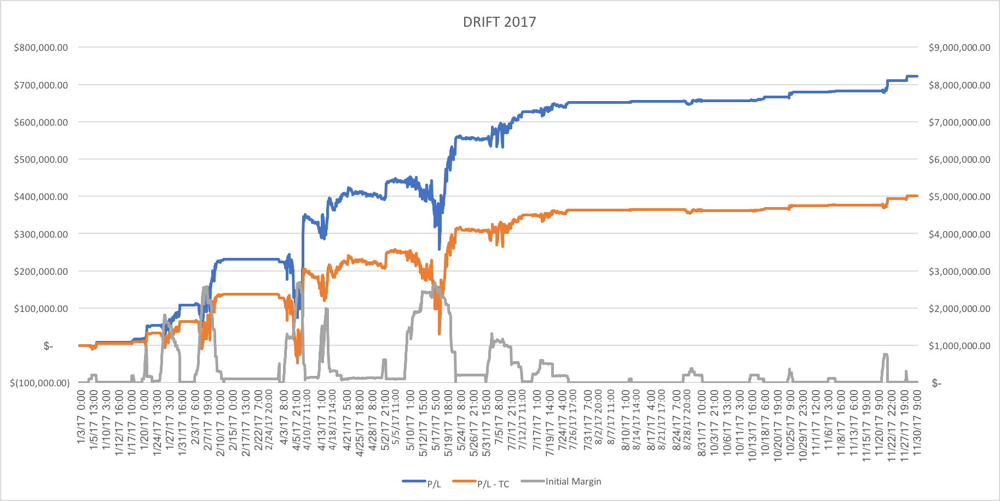

## Drift Model
Model Inventor: Prof. Raphael Douady

Strategy Engineer: Yuxuan(Jerry) Xia

Date: 2018/06/10

*Note: This program is only a small demo about back-testing system (not the whole strategy).*

### Performance:

|Metrics|Value|
|---|---|
|Risk-free Rate |	0.50%|
|Initial	 |$3,000,000 |
|Percentage Invested|30%|
|Performance	|24.09%|
|Gross Profit|13.38%|
|Max Recovery	|48.04166667|
|Volatility	|11.9%|
|Minimum Draw Down	|-6.98%|
|Sharpe|1.975501601|

### Input and Output

One can view this as a python implementation about the excel program developed by Prof. Douady. But with much better time-efficiency and robustness. This project is made to replace the old excel back-testing system. And all columns can be found in the excel file "TradesResult 2017Drift_new position_with spot unfrozen duration_Raphael_2.xlsm"

The system input is a data frame like the following, which we can calculate on the original matlab programs easily. Professor, Tony and Yao used to generate this data.

| DateTime        | PriceTU  | PriceFV  | PriceTY  | PriceUS  | PriceUB  | DurationTU | DurationFV | DurationTY | DurationUS | DurationUB | OptWeightTU | OptWeightFV | OptWeightTY | OptWeightUS | OptWeightUB | RollingAvg | RollingStd |
| --------------- | -------- | -------- | -------- | -------- | -------- | ---------- | ---------- | ---------- | ---------- | ---------- | ----------- | ----------- | ----------- | ----------- | ----------- | ---------- | ---------- |
| 2001/2/17 19:00 | 108.2969 | 117.5234 | 124.0469 | 150.2188 | 159.5938 | 1.957515   | 4.24503    | 6.222844   | 13.85058   | 17.46846   | 0.239421    | 0.176399    | -0.1359     | -0.26366    | 0.184626    | 19.72937   | 0.027984   |

The system output is a dataframe like the following. Along with the basic input columns, there are more information about the positions and performance of the DRIFT model which is marking to market hourly.

| DateTime       | PriceTU  | PriceFV  | PriceTY  | PriceUS  | PriceUB  | OptWeightTU | OptWeightFV | OptWeightTY | OptWeightUS | OptWeightUB | PortNotional | dfPositionTU | dfPositionFV | dfPositionTY | dfPositionUS | dfPositionUB | PortPrice | InitMargin | DailyPnL | CumNetPnL |
| -------------- | -------- | -------- | -------- | -------- | -------- | ----------- | ----------- | ----------- | ----------- | ----------- | ------------ | ------------ | ------------ | ------------ | ------------ | ------------ | --------- | ---------- | -------- | --------- |
| 2017/1/2 19:00 | 108.2969 | 117.5234 | 124.0469 | 150.2188 | 159.5938 | 0.239421    | 0.176399    | -0.1359     | -0.26366    | 0.184626    | 57890.65     | 6.930119     | 10.21183     | -7.86725     | -15.2632     | 10.68813     | 19.66085  | 0          | 0        | 0         |

PortNotional: portfolio notional

dfPositionXX: positions according to different bonds

PortPrice: portfolio price

InitMargin: initial margin

DailyPnL: daily P&L

CumNetPnL: cumulative P&L

### Introduction:

**Description**: A statistical arbitrage strategy for treasury futures trading using mean-reversion property and meanwhile insensitive to the yield change.

The DRIFT model is a system that builds a portfolio of treasury futures, typically the 5 following futures: TU, FV, TY, US, UB. The construction of this portfolio is based on the principle that, while in certain directions, the combined price evolution cannot be anticipated (random walk), in other directions, mean-reversion is observed (range behavior). When the combination of futures gets too far away from its historical range, it will have a strong tendency to move back towards the center of the range.

At every time t, we want to find a set of weights which, on one hand, is insensitive to yield curve changes in directions we can't anticipate, and on the other hand, is as much as possible away from its historical average in order to maximize the reversion strength towards this mean. This can be translated in mathematical terms as maximizing a distance to the mean, in number of standard deviations, under the linear constraints corresponding to insensitivity to certain directions.

Typically, we will select two directions in which the portfolio should be hedged: a parallel shift of the yield curve, and a "sloping up" by Log(T) where T is the maturity. Each future is represented by a bond that is driving its price: either the cheapest-to-deliver (CTD), or the on-the-run (OTR), or even a virtual bond with fixed duration and slope sensitivity (FD) set to an average value. The latter can be justified by the fact that the current driver of future prices may change over the life of a position.

Once we have identified the combination of futures which is the most out of its range, while hedged, the strategy consists in buying or selling the corresponding number of contracts in each future (some weights can be negative), wait for the move to occur in the direction we expect and unwind the position at a profit.

Three types of risk may occur: the position moves in the wrong direction, that is, even further away from its range, incurring margin calls that are too large to be sustained; the position fails to converge before the maturity of the futures, forcing us to unwind the positions with a random outcome; the market becomes illiquid and unwinding is performed with a slippage that cancels profit. Our experience and historical simulations tend to show that these 3 risks occur less often than the profits. We also note that leverage is not applied (no more than that provided by the exchange through margining) so losses, in case of one of these risks occurring, remain limited in size.

In practice, constraints are represented by two equations. Weights are optimized in a three-dimensional space (5 unknown weights, and 2 constraints). We find the set of weights W_0 that minimize the standardized value of a portfolio with those weights, i.e the ratio (Current Price - Moving Average)/Standard Deviation. In here, by "minimize", we mean finding the most negative standardized value, hence expecting the strongest move upward. If the standardized value is smaller than a specified entry level (a constant value), the value of a portfolio with weights W_0 has large probability to go up (because of the mean reversion property). In this case, we can also measure the expected profit, would the position fully converge towards the center of the range (i.e. the moving average). We compare this expected profit to the bid-ask spread, as a rough measure of the possible slippage when unwinding the position. A second threshold is applied in "number of ticks", that is, on the ratio of the expected profit to the bid-ask spread. If both ratios pass their respective threshold, buy and sell orders are then generated on the 5 futures to enter this position (or modify existing positions by these amounts).

Positions are closed when either a pre-specified profit is realized, or a stop-loss is applied (in case of adverse move) or the maturity of the first future to expire becomes too close and liquidity becomes uncertain.

###  Parameters

* Backtest period: Typical 2010-2017
  
	The time period we choose to conduct backtesting in the experiment. We conduct simulations quarter per quarter. Specifically, the start year/quarter and the end year/quarter need to be given. 
  
	If the quarter is not specified, it means that the full year (Q1-Q4) is simulated.
  
* Number of components: Typical 5 
  
	The number of different futures contracts that will be included in the portfolio. Typically 5 futures (see below).
  
+ Future contracts: Typical TU-FV-TY-US-UB

    The type of future contracts we choose to construct our portfolio. The most frequently used contracts include:
    
	* {TU: 2-year US Treasury Note Futures}
    
	* {FV: 5-year US Treasury Note Futures}
    
	* {TY: 10-year US Treasury Note Futures}
    
	* {US: 30-year US Treasury Bond Futures}
    
	* {UB: Ultra US Treasury Bond Futures}

    Currently, we don't use TN because it is less liquid than the others. Simulations in other currencies and countries is envisioned.
    
- Future historical data frequency: Typical 1H

    The frequency of futures price data we used for backtesting, which can be viewed as the shortest distance in the timeline between two adjacent data points.
    Currently, the frequency of simulations is hourly (1H)
    
	We are planning simulations with frequency 10 minutes (10M) and 1 minute (1M).

* Hedging constraints: Typical 2

    We currently use only 2 constraints: sensitivity to paraller shift and to sloping by Log(T).

+ Bonds representing the futures: Typical CTD

    Hedging constraints depend on tbe bonds that represent each future, and on the calculation of sensitivity.
    
	The bonds, selected in the eligible basket of each future, can be:

    * (CTD: Cheapest-To-Delivery): 
    
	Cheapest to deliver in a futures contract is the cheapest security that can be delivered to the long position in this future contract to satisfy the contract specifications, afer applying the conversion ratio. It is determined as the bond with the highest implied repo rate in the eligible basket.

    * (OTR: On-the-Run): 
    
	On-The-Run in a futures contract refers to the bond last issued in the futures.

    * (FD: Fixed Duration): 
	
	Durations are set to an average value, namely (***PLEASE PROVIDE CHOSEN FIXED VALUES***)

- Sensitivity Calculation: Typical DlogD

    Once the bond representing each future has been determined, the sensitivity to parallel shift (the first constraint) is given by its duration. This is a simple calculation using its maturity, coupon rate and price. The duration is directly given in the (FD) case.
    The sensitivity to sloping up is either computed exactly (SlogT), using the maturity, coupon and price, of approximated by the formula Duration*Log(Duration) (DlogD)
    In the (FD) case, only the aproximation (DlogD) is used;

* Moving Average Types and Size: Typical SMA300

    The Moving Average of price data is used to locate the center of the range and determine the trend direction.
    We may choose either a Simple Moving Average over a sliding window (SMA) or an Exponential Moving Average (EMA).

    + {SMA: Simple Moving Averages): 
    In the Simple case, the moving average depends on the size of the sliding window, in number of time periods (depending on the freauency). For example SMA300 means Simple Moving Average over a sliding window of size 300 time periods (e.g. hours if hourly data).

    + {EMA: Exponential Moving Averages):
    In the Exponential case, the moving average depends on the Decay Factor, which is comparable to the inverse of the sliding window size in the Simple case. For instance, EMA300 means an Exponential Moving Average computed with decay factor 1/300.

* Initial portfolio: Typical 10MM

The initial dollar value of our portfolio, e.g. 10MM for $10,000,000
We use K = Thousands, MM = Millions, Bn = Billions

==================================================================================================================

* Investment ratio: 

    This ratio measures the percentage of initial portfolio that can be used in our trading. For example, if the initial value of portfolio is \$100 and we constraint that only \$20 can be used in trading. The value of this ratio is 5.
    
* Entry Threshold: 

    A constant number which is set as a criteria of entering the market    

* Exit Threshold:

    A constant number which is set as a criteria of leaving the market(close the positions)        

* Stop-loss level: 

    The criteria we set to close the positions and stop loss.       

* Minimum Change Quantity: Typical 200
    Considering trading cost, we only change our positions when the sum of absolute changes in all futures contracts are larger than the minimum change quantity.

### Methodology
At time t,

* Step 1: Optimization

    Minimize Objective Function: $$obj=\frac{V-\mu}{\sigma}\\ =\frac{\sum_i(p_i*w_i)-MA(\sum_i(p_i*w_i))}{std(\sum_i(p_i*w_i))}$$

    Constraint Functions: $$\sum_i(d_i*p_i*w_i)=0;\\ \sum_i(d_i*ln(d_i)*p_i*w_i)=0$$
    
    Can't get the point of the constraint 2. I suppose there is a margin constraint
    $$\sum_i p_i*w_i*margin_i = position\ init\ margin$$

    Sum means sum from $i=1$ to the number of components. MA means moving avarage. $p_i$ is the price of the i-th futures at t, $w_i$ is the weight of i-th futures, $d_i$ is the bond duration we use for the i-th futures. 

	We suppose that the optimized weight vector is denoted as $W_0$ (capital letter means vector), and the optimized value of objective function is $r_0$.

* Step 2: 

    If our current positions taken is not 0, go to step 3. Otherwise, go to step 4.

* Step 3: 

    Put our current weights and portfolio value in objective function in step 1, and we can calculate $r_c$. If $r_c$ is smaller than stop-loss level times bid-ask spread, or larger than the exit threshold times bid-ask spread, go to step 4. Otherwise, keep our positions unchanged. Steps at time t end.

* Step 4: 
    If $r_0$ got in step 1 is smaller than the enter ratio times bid-ask spread, calculate the optimized number of contracts of all futures according to $W_0$, required margins, and our portfolio value. Go to step 5. Otherwise, close our positions. Steps at time t end.

* Step 5:
  
	If the changes of optimized numbers of contracts from our current contract numbers are smaller than the minimum change quantity, keep positions unchanged. Otherwise, change our current positions to the optimized positions we calculate in step 4.

### Inputs Files

* Futures data from DTN

    Futures' historical price data obtained from DTN.iqfeed by a Python program. Data is stored in csv file which is named after the futures contract's symbol in DTN. Each csv file consists of 7 columns. The 1st column shows the time, in a format of yyyy-mm-dd HH:mm:ss. 2nd to 5th column indicate the price of futures and 6th and 7th show that incremental volume and total volume. We only take the first column(date time information) and fifth column(close price information) in our back testing. 
  
* Duration data
  
	Basic information of bond's data is firstly obtained from WSJ dataset. We selected duration data from them and match them with futures contracts by date time. 

### Outputs Files

* output.csv

  This file stores the performance of our portfolio in one calendar year (e.g. 2017-01-01 to 2017-12-31). Specifically, the 1st column is the date time, the 2nd to 6rd columns are the quoted price for different treasury futures. The 7th to 11th columns are the optimal weights we obtained using step 1 constraints. The 12th column is the portfolio total notional. The 13th to 17th column are portfolio positions on different futures. The 18th column is the portfolio price. The 19th column is the initial margin we should put in exchange. The 20th column is the daily PnL. The 21th column is the cumulative net PnL removing the transaction cost.

### Code
Code files needed: BacktestMain.m, Backtest.m, fraction1.m, hourlyDTN1.m, calduration.m, optimizeSharpe.m. For this project, MATLAB output is the input of our backtesting and algorithm trading system.

Utils.py: Some in-hands functions

BackTesting.py: Defined the class of Positions to handle position changes and closes. Defined the class BackTestingSystem to get the results

test_script: run test_script.py with parameters as next section, and it calls other functions(utils) in running process.

BackTestingScript.ipython: An interactive python(ipython) file can be opened by jupyter notebook.

Input data can be obtained by the following MATLAB files which defined in Methodology section (todo: replicate all of them into Python with SciPy)

* hourlyDTN.m: 

    to get the hourly data from DTN.

* calduration.m: 

    to calculate durations and ln(duration)'s of bond.

* fraction1.m: 
  
	to get the objective function.

* optimizeSharpe.m: 
  
	to get the optimized W_0 and r_0 in Methodology step 
